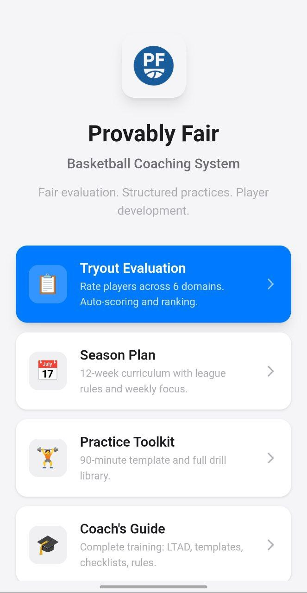
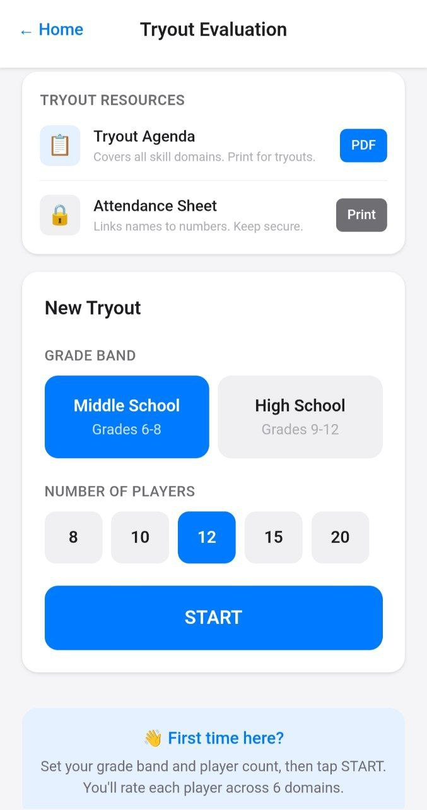
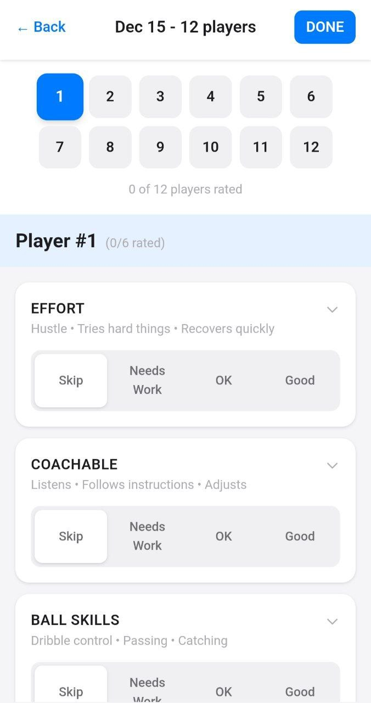

# Provably Fair Basketball

A privacy-first toolkit for youth basketball coaches: tryout evaluation, season planning, practice resources, and parent communication.

**Live tool:** https://provablyfairbasketball.com/

---

## Screenshots

<p align="center">
  
  
  
</p>

---

## Why This Exists

I built this for my kids' school to reduce the overwhelm of becoming a coach and to make tryouts more structured, transparent, and student-protective.

I'm sharing it publicly in case it helps other coaches and schools.

---

## What It Includes

- **Tryout Evaluation** — Rate players across 6 skill domains (numbers-only; no student names stored)
- **Printable Attendance Sheet** — Paper-only link between names and jersey numbers
- **Tryout Agenda PDF** — Structured tryout flow covering all skill domains
- **12-Week Season Plan** — Weekly themes, practice plans, adjustable start date
- **Practice Toolkit** — Drill library + quick session templates
- **Parent Email Templates** — Copy-paste communication for common situations
- **School Statement Template** — Ready-to-use admin statement for parents/board
- **FAQ** — Answers for coaches, parents, and administrators

---

## Privacy Model

This tool was designed with student privacy as a core constraint:

- **No student names** are entered into the digital tool
- **Data stays in your browser** (localStorage only)
- **No accounts, no cloud storage, no external database**
- **Paper attendance sheet** is the only place names and numbers are linked

The coach controls the app. The school controls the paper.

---

## Tech Stack

- React + Vite
- Tailwind CSS
- Deployed on Netlify

---

## Local Development

```bash
npm install
npm run dev
```

Build for production:

```bash
npm run build
```

---

## Repo Status

This repository mirrors the deployed tool at https://provablyfairbasketball.com/.

- **Issues:** Enabled for bug reports only
- **Pull requests:** Not currently accepted
- **Feature requests:** Not accepted at this time

---

## License

MIT
